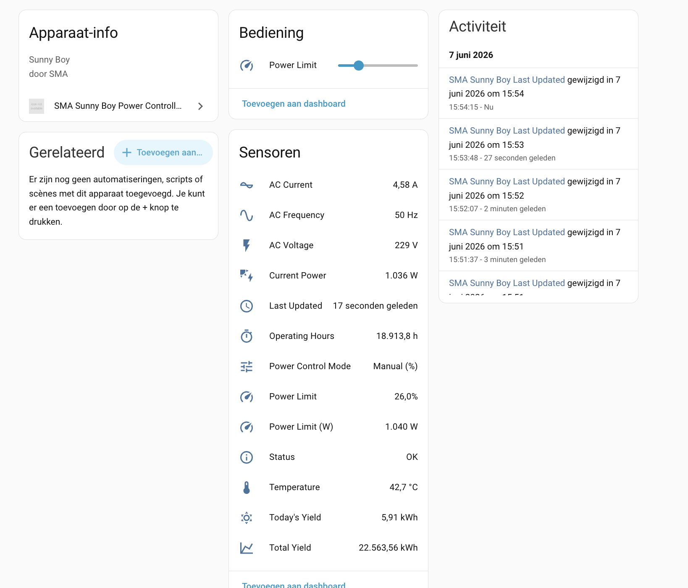
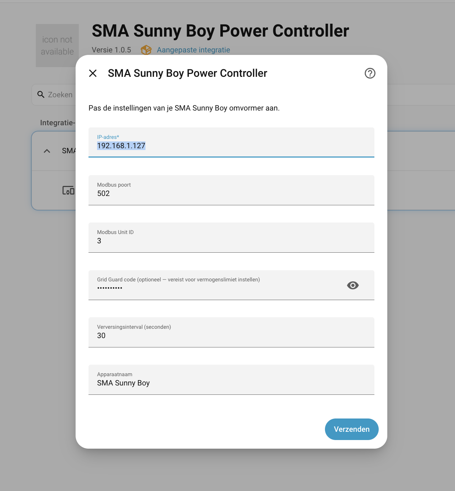

# SMA Sunny Boy Power Controller — Home Assistant Integration


[](https://github.com/hacs/integration)

A local-polling Home Assistant integration for **SMA Sunny Boy** solar inverters using **Modbus TCP**.  
No cloud account required — communicates directly with the inverter on your local network.



---

## Features

| Entity | Type | Description |
|---|---|---|
| Current Power | Sensor | AC output power (W) |
| Today's Yield | Sensor | Energy produced today (kWh) |
| Total Yield | Sensor | Lifetime energy yield (kWh) |
| AC Voltage | Sensor | Grid voltage (V) |
| AC Current | Sensor | Grid current (A) |
| AC Frequency | Sensor | Grid frequency (Hz) |
| Temperature | Sensor | Inverter internal temperature (°C) |
| Status | Sensor | OK / Off / Warning / Error |
| Power Limit | Sensor | Active power limit (%) |
| Power Limit (W) | Sensor | Active power limit (W) |
| Power Control Mode | Sensor | Active control mode label |
| Operating Hours | Sensor | Total operating hours |
| **Power Limit** | **Number** | **Set power limit 0–100 % via slider** |

---

## Prerequisites

1. **SMA Sunny Boy** inverter with Modbus TCP enabled.
2. The inverter must be reachable on your local network (fixed IP recommended).
3. *(Optional)* Your **SMA Grid Guard code** (numeric, typically printed on a label inside the inverter) — required only if you want to **control** the power limit. Reading sensor data works without it.

### Enabling Modbus TCP on the inverter

- Log into the SMA web interface (usually `http://<inverter-ip>`)
- Navigate to **Device Parameters → External Communication → Modbus TCP**
- Set **Modbus TCP** to **Enabled**
- Note the **Unit ID** (default: `3`)

### Enabling external power limit control

For the power limit slider to have any effect, the inverter must be set to accept external setpoints:

- Log into the SMA web interface with **installer rights**
- Navigate to **Device Parameters → Active Power → Operating mode active power setpoint**  
  *(Dutch: **Apparaatparameters → Bedrijfsmodus voorinstelling actief vermogen**)*
- Set the value to **External preset** *(Dutch: **Externe voorinstelling**)*

Without this setting, Modbus write commands for the power limit are silently ignored by the inverter.

---

## Installation

### Via HACS (recommended)

1. Open **HACS** in Home Assistant.
2. Go to **Integrations → ⋮ → Custom repositories**.
3. Add `https://github.com/brambruning/ha-sunny-boy-power-control` with category **Integration**.
4. Search for **SMA Sunny Boy Power Controller** and click **Download**.
5. Restart Home Assistant.

### Manual

1. Copy the `custom_components/sma_sunny_boy_modbus/` folder into your Home Assistant `config/custom_components/` directory.
2. Restart Home Assistant.

---

## Configuration

1. Go to **Settings → Devices & Services → + Add Integration**.
2. Search for **SMA Sunny Boy Power Controller**.
3. Fill in the form:

| Field | Default | Description |
|---|---|---|
| IP Address | — | IP address of the inverter |
| Modbus Port | `502` | Modbus TCP port |
| Modbus Unit ID | `3` | Unit ID (check inverter settings) |
| Grid Guard Code | *(empty)* | Numeric code for write access (power limit control) |
| Update interval | `30` | Polling interval in seconds |
| Device name | `SMA Sunny Boy` | Friendly name shown in HA |

Home Assistant will attempt a test connection. If it fails, check the IP address and ensure Modbus TCP is enabled.



---

## Setting the power limit

The **Power Limit** number entity (range 0–100 %) is available on the device page and can be added to dashboards as a slider.

You can also call it from automations:

```yaml
# Set power limit to 50 %
service: number.set_value
target:
  entity_id: number.sma_sunny_boy_power_limit
data:
  value: 50
```

> **Note:** The Grid Guard code is required for the write to succeed. The inverter may reset the limit after a restart or on the next communication cycle depending on firmware.

---

## Automation examples

The entity ID for the power limit slider follows the pattern `number.<device_name>_power_limit`.  
With the default device name **SMA Sunny Boy** this becomes `number.sma_sunny_boy_power_limit`.

### Limit power when electricity return price is negative (Tibber)

Automatically sets the inverter to 0 % when you are paying to feed back into the grid,
and restores it to 100 % when the price becomes positive again.

```yaml
description: "Limit SMA output on negative electricity price"
mode: single
triggers:
  - trigger: numeric_state
    entity_id: sensor.tibber_current_price
    below: 0
    id: price_negative
  - trigger: numeric_state
    entity_id: sensor.tibber_current_price
    above: 0
    id: price_positive
conditions: []
actions:
  - choose:
      - conditions:
          - condition: trigger
            id: price_negative
        sequence:
          - action: number.set_value
            target:
              entity_id: number.sma_sunny_boy_power_limit
            data:
              value: 0
      - conditions:
          - condition: trigger
            id: price_positive
        sequence:
          - action: number.set_value
            target:
              entity_id: number.sma_sunny_boy_power_limit
            data:
              value: 100
```

### Limit output during peak hours

Reduces output to 50 % between 17:00 and 21:00 (typical high-demand window) and
resets to 100 % outside those hours.

```yaml
description: "Limit SMA output during peak hours"
mode: single
triggers:
  - trigger: time
    at: "17:00:00"
    id: peak_start
  - trigger: time
    at: "21:00:00"
    id: peak_end
conditions: []
actions:
  - choose:
      - conditions:
          - condition: trigger
            id: peak_start
        sequence:
          - action: number.set_value
            target:
              entity_id: number.sma_sunny_boy_power_limit
            data:
              value: 50
      - conditions:
          - condition: trigger
            id: peak_end
        sequence:
          - action: number.set_value
            target:
              entity_id: number.sma_sunny_boy_power_limit
            data:
              value: 100
```

---

## Register map

The following SMA Modbus registers are used (all read with FC 0x03):

| Register | Type | Scale | Description |
|---|---|---|---|
| 30201 | U32 ENUM | — | Device status |
| 30203 | U32 | W | Nominal AC power |
| 30513 | U64 | Wh→kWh ÷1000 | Total yield |
| 30517 | U64 | Wh→kWh ÷1000 | Daily yield |
| 30521 | U64 | s→h ÷3600 | Operating time |
| 30775 | S32 | W | AC real power |
| 30783 | U32 | ÷100 → V | AC voltage |
| 30795 | U32 | ÷1000 → A | AC current |
| 30803 | U32 | ÷100 → Hz | AC frequency |
| 30835 | U32 ENUM | — | Active power mode (status) |
| 30837 | U32 | W | Active power setpoint (W) |
| 30839 | U32 | % | Active power setpoint (%) |
| 30953 | S32 | ÷10 → °C | Internal temperature |
| 40210 | U32 ENUM | — | Active power mode (config, writable) |
| 40212 | U32 | W | Power limit in Watts (writable) |
| 40214 | U32 | % | Power limit in % (writable) |
| 43090 | U32 | — | SMA Grid Guard login |

---

## Tested with

- SMA Sunny Boy SB 4.0-1AV-41

Other Sunny Boy models should work as long as they support Modbus TCP and use the same register map. Community reports of other tested models are welcome via GitHub Issues.

---

## Troubleshooting

**Cannot connect**
- Verify the IP address is correct and the inverter is reachable (`ping <ip>`).
- Check that Modbus TCP is enabled in the SMA web interface.
- Make sure no firewall is blocking port 502.

**Power limit write fails / no effect**
- The Grid Guard code is required. It is a numeric code (not the user or installer web password).
- Verify the code is correct — wrong codes are silently ignored by the inverter.
- Some firmware versions require the code to be entered within a short time window.

**Sensors show `Unknown`**
- The inverter may be in night mode (no sun). Registers return invalid sentinel values (0xFFFF 0xFFFF) which the integration converts to `None`/`Unknown`.

**High polling errors in the log**
- Increase the update interval (default 30 s). The inverter's Modbus server may be slow to respond.

---

## License

This project is released into the public domain — see [LICENSE](LICENSE) for details.
